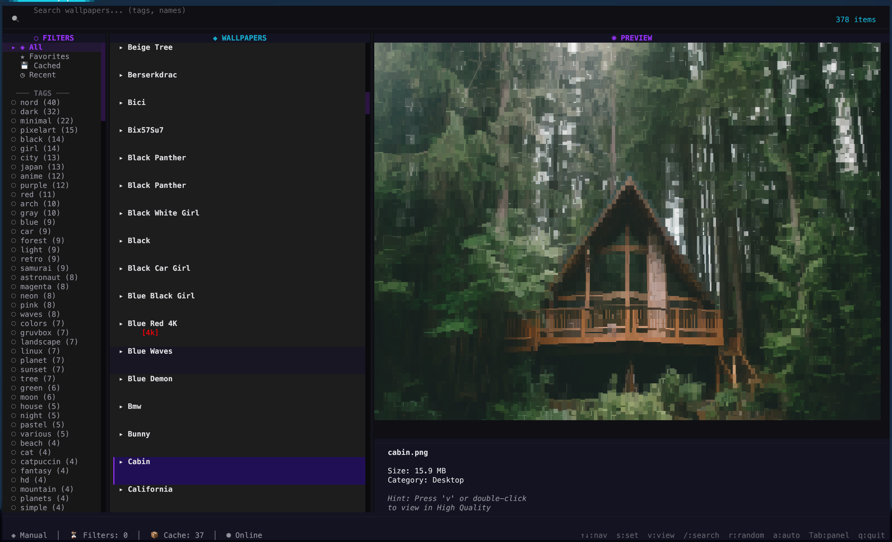
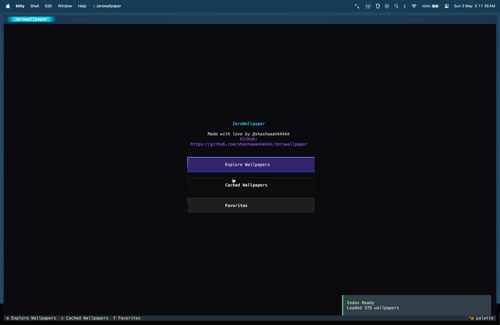

<div align="center">

  <pre>
█████ █████ ████   ███  █   █  ███  █     █     ████   ███  ████  █████ ████  
   █  █     █   █ █   █ █   █ █   █ █     █     █   █ █   █ █   █ █     █   █ 
  █   ████  ████  █   █ █ █ █ █████ █     █     ████  █████ ████  ████  ████  
 █    █     █  █  █   █ ██ ██ █   █ █     █     █     █   █ █     █     █  █  
█████ █████ █   █  ███  █   █ █   █ █████ █████ █     █   █ █     █████ █   █  
  </pre>
  <p align="center">
    <strong>The ultimate terminal-based aesthetic wallpaper engine.</strong>
  </p>

  <p align="center">
    <a href="https://github.com/shashaaankkkkk/zerowallpaper/stargazers"></a>
    <a href="https://pypi.org/project/zerowallpaper/"></a>
    <a href="https://github.com/shashaaankkkkk/zerowallpaper/blob/main/LICENSE"></a>
  </p>

  <p align="center">
    <a href="#✨-features">Features</a> •
    <a href="#📦-installation">Installation</a> •
    <a href="#⌨️-usage">Usage</a> •
    <a href="#⚙️-configuration">Configuration</a>
  </p>
</div>

<br />

---

## 🖼️ Gallery

<div align="center">
  <p><strong>Experience the fluid UI and high-fidelity rendering</strong></p>
  
  <br />
  
</div>

---

## ✨ Features

- 🌌 **Aesthetic-First**: Curated wallpapers from the best sources on GitHub.
- 🚀 **Streamed, Not Cloned**: Zero local storage bloat. We stream only what you want to see.
- 🖥️ **High-Fidelity Rendering**: Native support for **Kitty**, **WezTerm**, and **iTerm2** with Chafa fallback.
- ⚡ **Turbo Filtering**: Instantly search by tags, name, or category with real-time updates.
- 💖 **Native Favorites**: Keep your favorite aesthetics just one keystroke away.
- 🔄 **Smart Auto-Changer**: A lightweight background daemon that keeps your desktop fresh.
- 🎹 **Keyboard Focused**: Designed for power users. No mouse required, but fully supported.

## 📦 Installation

ZeroWallpaper is just a pip command away:

```bash
pip install zerowallpaper
```

> [!TIP]
> For the best visual experience, install **chafa** on your system:
> `brew install chafa` (macOS) or `sudo apt install chafa` (Linux).

## ⌨️ Usage

Launch the engine:

```bash
zerowallpaper
```

### 🎮 Controls

| Key | Action |
| :--- | :--- |
| <kbd>↑</kbd> <kbd>↓</kbd> | Navigate wallpapers |
| <kbd>Enter</kbd> | Preview wallpaper |
| <kbd>s</kbd> | **Set wallpaper** |
| <kbd>Shift</kbd> + <kbd>E</kbd> | **Explore** All |
| <kbd>Shift</kbd> + <kbd>C</kbd> | View **Cached** |
| <kbd>Shift</kbd> + <kbd>F</kbd> | View **Favorites** |
| <kbd>f</kbd> | Toggle Favorite |
| <kbd>a</kbd> | Toggle Auto-changer |
| <kbd>/</kbd> | Search |
| <kbd>Tab</kbd> | Cycle panels |
| <kbd>q</kbd> | Exit |

## ⚙️ Configuration

ZeroWallpaper keeps things simple. Your config and cache live at `~/.zerowallpaper/`.

### 🔑 GitHub Token (Optional)

To avoid GitHub's unauthenticated rate limits, set a personal access token:

```bash
export GITHUB_TOKEN="ghp_your_token_here"
```

## 📜 License

Distributed under the MIT License. See `LICENSE` for more information.

---

<div align="center">
  <p>Built with 💜 by <a href="https://github.com/shashaaankkkkk">@shashaaankkkkk</a></p>
  <p><i>Making the terminal beautiful, one wallpaper at a time.</i></p>
</div>
